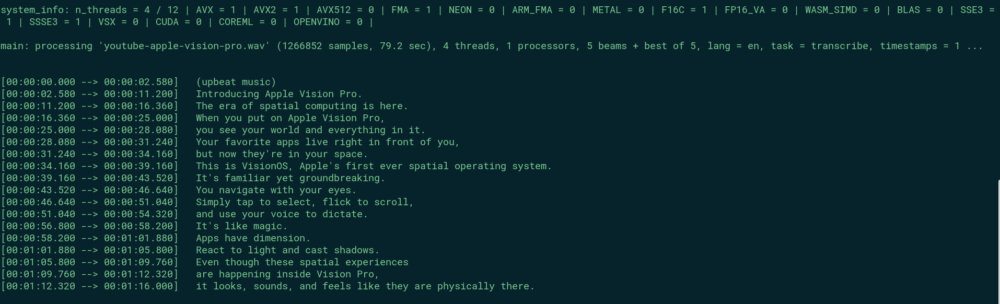
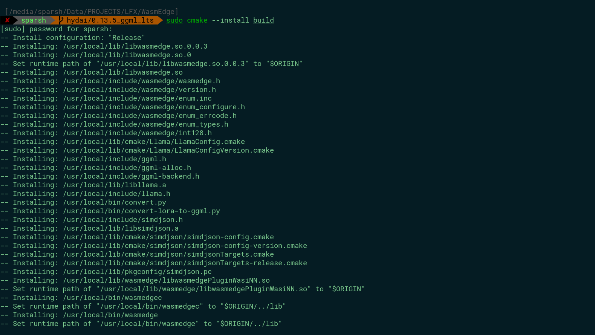

# Pre-Test for LFX-WasmEdge ([#3170](https://github.com/WasmEdge/WasmEdge/issues/3170))

<br>

!! Using the [`hydai/0.13.5_ggml_lts`](https://github.com/WasmEdge/WasmEdge/tree/hydai/0.13.5_ggml_lts) branch for this pre-test


## Configuration

! **Operating System** : Ubuntu 22.04

! **Shell**: Zsh (Oh-my-Zsh)

! **CPU** : AMD Ryzen 5 4600H

! **GPU** : NVIDIA GTX 1650 (4GB VRAM)


<hr>


# Section 1: Building Whisper.cpp from source

Building whisper.cpp was a quite trivial process.
I followed the steps below -:


### Step 1: Cloning the whisper.cpp repository

```
git clone https://github.com/ggerganov/whisper.cpp && cd whisper.cpp
```
### Step 2: Choosing a model

Since `whisper.cpp` supports `quantization` techniques, it is possible to reduce the size of the model and the memory it takes to load.

I have chosen to download the `q5` quantized model based on my current hardware.

Also, I am going to download the `base-en` version of Whisper since I don't require the inference in other languages.


### Step 3: Downloading the model (in `GGML` format)

```
wget https://huggingface.co/ggerganov/whisper.cpp/resolve/main/ggml-base.en.bin
```

### Step 4: Building the whisper.cpp binaries

```
make
```


We have built the `main` binary now.

<br> 

### Step 5: Running the transcription


Running an audio transcription on a recent YouTube video of Apple Vision Pro. Let's see how it goes :grin:

```
./main -m ggml-base.en.bin -f youtube-apple-vision-pro.wav
```



It was actually quite accurate and quick. It just took around **8 seconds** for that length.

<hr>

# Section 2A: Building WasmEdge with WASI-NN llama.cpp backend


WASI-NN is a WasmEdge plug-in used for machine learning (neural network) functions.

Currently, WASI-NN supports the following backends:
- OpenVINO™ 
- PyTorch
- TensorFlow Lite 
- [`llama.cpp`](https://github.com/ggerganov/llama.cpp)

I am building the `llama.cpp` backend in this walthrough. 
`llama.cpp` is the C++ port of the famous LLaMA model by Facebook. 

It supports inferencing the model on low-end GPUs as well as on CPU-only systems by allowing the use of `quantization` on model weights

<br>

By default, WASI-NN backends are not automatically enabled in the normal build of WasmEdge. 
I built it with the following steps -:


### Step 1: Cloning the WasmEdge repository 

```
git clone https://github.com/WasmEdge/WasmEdge && cd WasmEdge
```


### Step 2: Installing the required dependencies</summary>

```
# Tools and Libraries
sudo apt install software-properties-common cmake libboost-all-dev

# LLVM and LLD (Linker)
sudo apt install llvm-14-dev liblld-14-dev

# GCC
sudo apt install -y gcc g++
```

<br>

### Step 3: Building (without GPU acceleration)

```
cmake -GNinja -Bbuild -DCMAKE_BUILD_TYPE=Release -DWASMEDGE_PLUGIN_WASI_NN_BACKEND="GGML" -DWASMEDGE_PLUGIN_WASI_NN_GGML_LLAMA_BLAS=OFF .
```


### Step 4: Installing the GGML backend
```
sudo cmake --install build
```



<hr>

# Section 2B: Testing the plug-in

After installation, I wanted to test the plug-in. So I created an API server using [LlamaEdge](https://github.com/second-state/LlamaEdge) using the following steps:- 

### Step 1: Downloading the pre-compiled WASM of API Server
```
curl -LO https://github.com/second-state/LlamaEdge/releases/latest/download/llama-api-server.wasm
```

### Step 2: Choosing a model

Now here comes the interesting part, `llama.cpp` supports a wide variety of models including (but not limited to) -:

- LLaMA 2 (and its fine-tunes)
- Mistral
- Mixtral (Mixture of Experts)
- Multi-modal models like LLaVa

I am going to use the `Wizard-Vicuna-Uncensored` model, which is a part of the Llama 2 family of LLMs.

<br> 

### Step 3: Choosing the right weight/parameters

Models like LLaMA 2 are released in different variants based on the number of parameters used in training: 7B, 13B, 33B etc)
Higher the parameters, higher is it's performance constraints. 
Based on my System configuration, I am going to use the `7B parameter` variant

<br> 

### Step 4: Choosing the right quantization

Since llama.cpp uses the ``GGUF`` (previously `GGML`) model architecture, it is possible to reduce the size of the model weights by using a technique called `quantization`

It supports 2-bit, 3-bit, 4-bit quantization, and so on.
Lower the quantized bits, the lesser accurate the model is but also the faster and less memory consuming it is.

I am going to **download** the `2-bit` quantized model based on my hardware.

```
wget "https://huggingface.co/TheBloke/Wizard-Vicuna-7B-Uncensored-GGUF/resolve/main/Wizard-Vicuna-7B-Uncensored.Q2_K.gguf"
```

### Step 5: Running the API Server

Starting the server is fairly simple now, we just need to pass the **model path** and the **prompt template**.

```
wasmedge --dir .:. --nn-preload default:GGML:AUTO:Wizard-Vicuna-7B-Uncensored.Q2_K.gguf llama-api-server.wasm -p vicuna-1.1-chat -g 0
```


**Port**: 8080

<br> 

### Step 6: Making calls to the server

Now, I tried 2 ways of calling the sever. One is simply through the terminal using `curl`


The other way is to use this server with an agent framework like `Langchain` since our server follows the API spec of OpenAI.

I have written the Python code for that which can be found [here](langchain-example/index.py)

